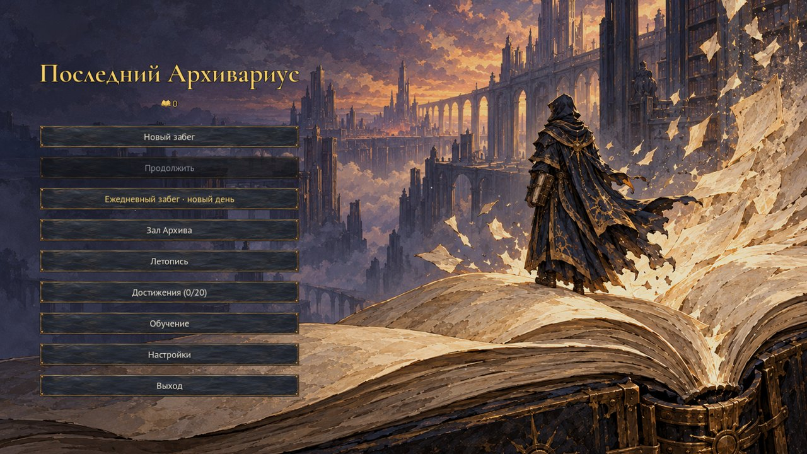
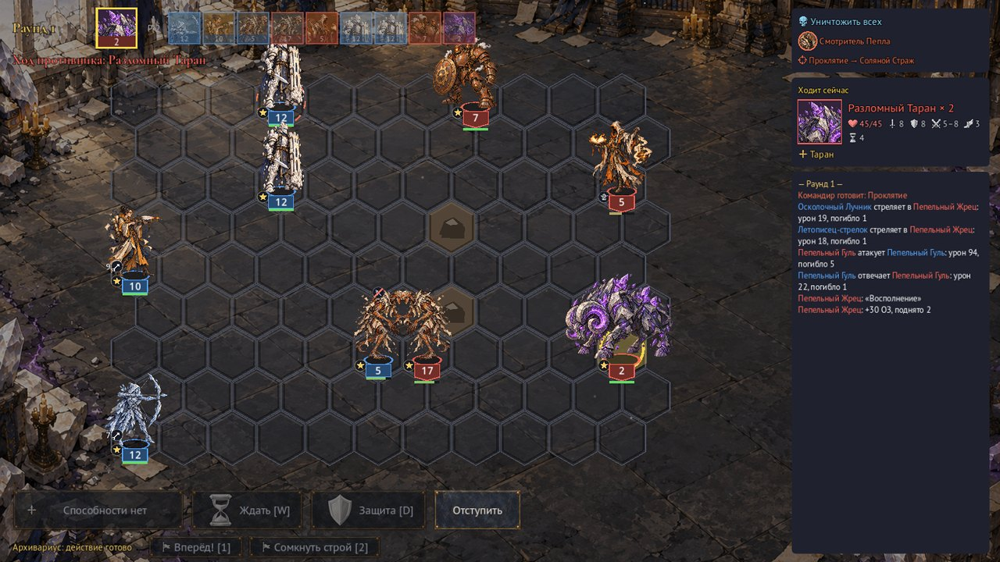
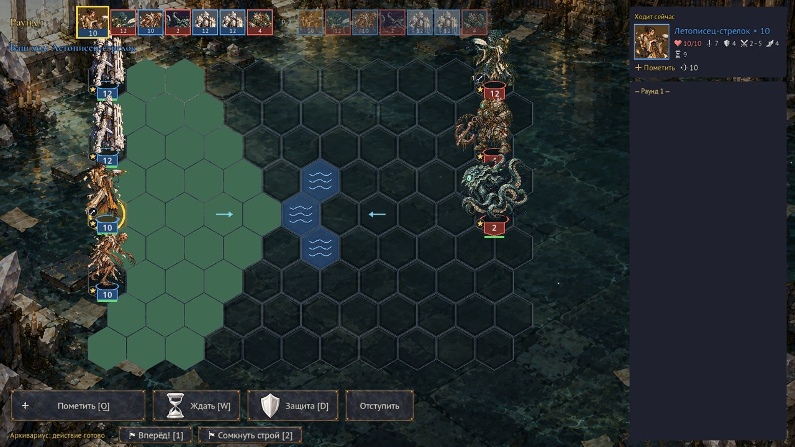
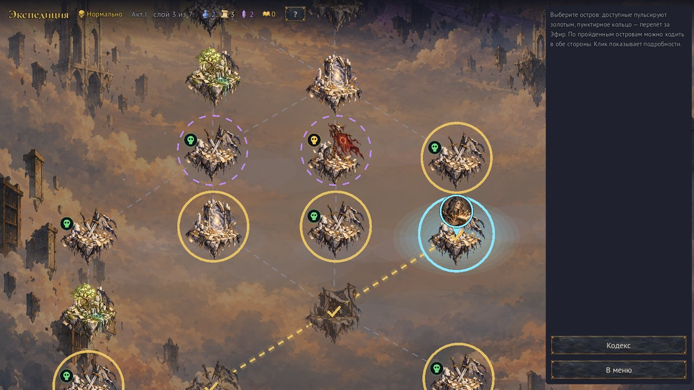
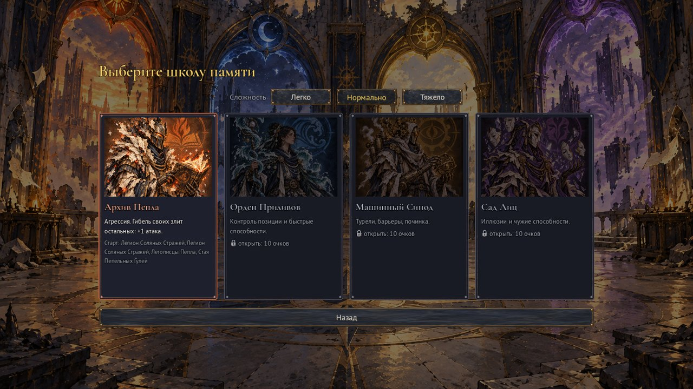
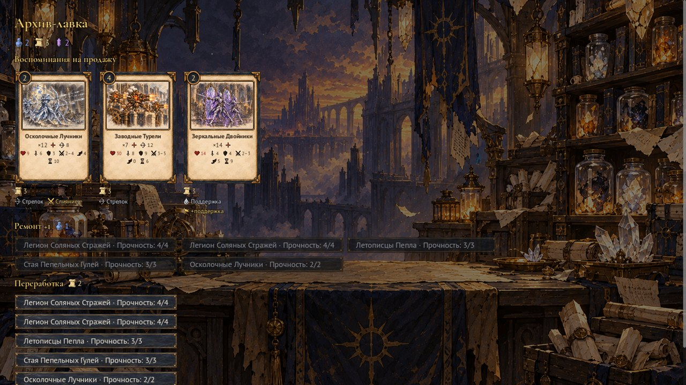
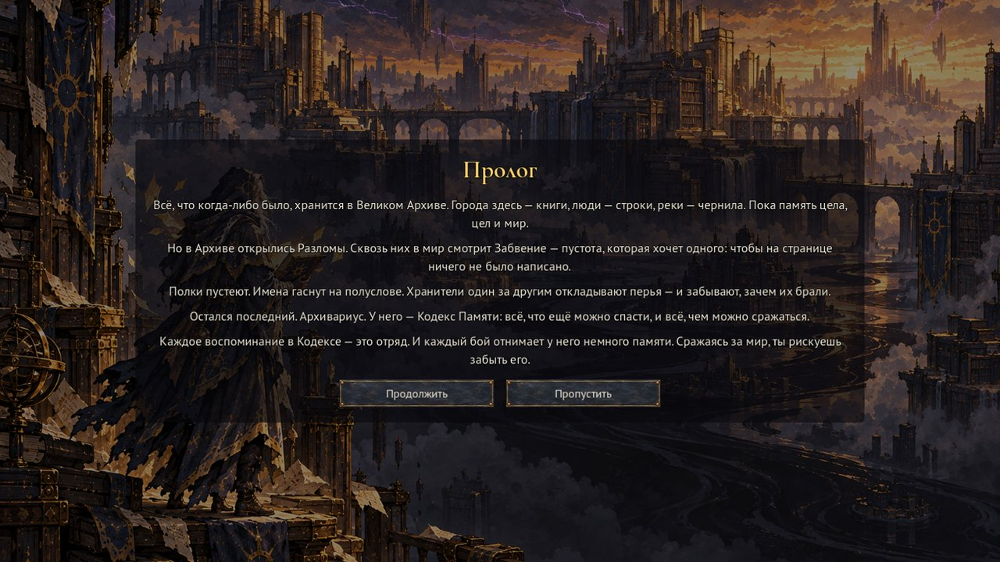
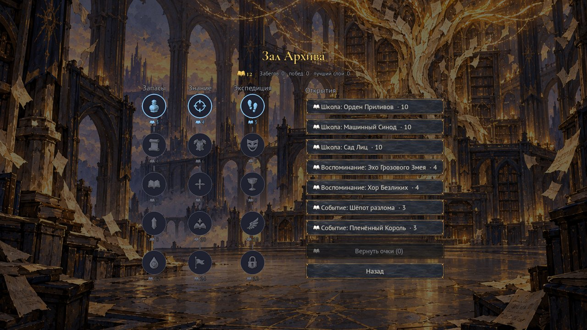
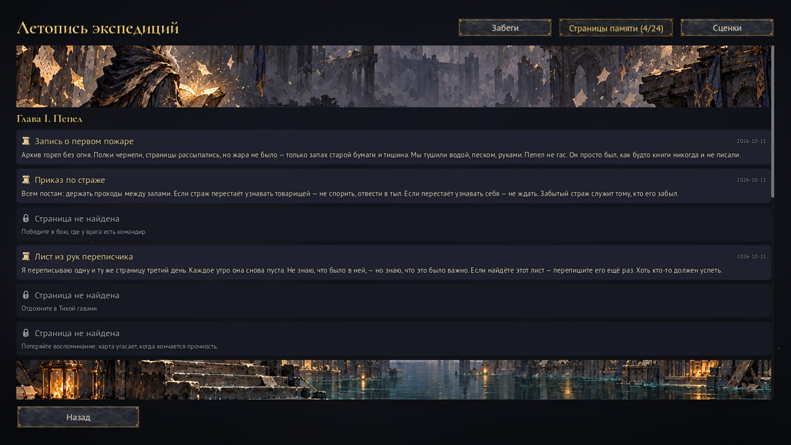

# Последний Архивариус

Пошаговый тактический рогалик в духе Heroes of Might and Magic. Бои проходят на гексагональном поле, армия собирается из колоды воспоминаний.

Мир стирается. Архивариус хранит последние воспоминания о нём в Кодексе Памяти. Каждая карта Кодекса — это отряд, заклинание или улучшение героя. В бою карты угасают: армия, которой вы сражаетесь, и есть то, что вы рискуете забыть.

**Движок:** Godot 4.7 (GDScript), 2D, интерфейс на русском, ПК, мышь, 1920×1080.



## Скриншоты

| | |
|---|---|
|  |  |
| Бой первого акта: стеки на гексах, очередь ходов, намерения командира, журнал боя | Второй акт: вода и течения на поле, подсвечены клетки хода |
|  |  |
| Карта экспедиции: острова и мосты, риск боёв, отметка «Вы здесь» | Четыре школы памяти и выбор сложности |
|  |  |
| Архив-лавка: воспоминания, ремонт и переработка карт | Сюжетная сценка: пролог |
|  |  |
| Зал Архива: улучшения и открытия между забегами | Летопись: страницы памяти по главам |

Скриншоты снимает `tools/screenshots.tscn` (нужно окно); в `docs/screenshots/` они лежат в JPG 1280×720.

## Как играется

- **Бой.** Поле из гексов 11×9 со стеками существ. Ходят по инициативе: можно ждать, обороняться, стрелять, бить в ответ, применять способности. Герой стоит вне поля и раз в раунд отдаёт приказ или колдует. У боёв разные цели: уничтожить всех, продержаться, защитить архив, убить цель.
- **Кодекс Памяти.** Колода до 12 карт. Каждый бой участвующие карты теряют прочность и в конце угасают. После победы можно взять новое воспоминание или переработать старое: в заклинание, в улучшение героя, слить с другой картой или пожертвовать.
- **Экспедиция.** Карта островов, связанных мостами; по мостам можно ходить в обе стороны и вернуться за пропущенными островами до Разлома. На островах — бои, элита, лавка, Тихая гавань, события, реликварии. Три ресурса: Чернила, Пергамент, Эфир. Разведка и перелёт между полосами стоят ресурсов.
- **Два акта.**
  - Первый акт — Архив, в конце босс: Разлом.
  - Между актами привал: ремонт Кодекса или дар.
  - Второй акт — Затопленные хранилища: постоянная вода, течения, чернильные облака. Финальный босс — Хозяин Глубин, у него две фазы.
- **Враги.** Командиры с объявленными намерениями, 4 типа целей боя, 3 сложности: Легко, Нормально, Тяжело.
- **Четыре школы памяти** со своими стартовыми колодами и пассивками: Архив Пепла, Орден Приливов, Машинный Синод, Сад Лиц.
- **Между забегами.** Очки памяти, Зал Архива, Испытания 1–10, 20 достижений, Летопись забегов, лучший Кодекс каждой школы.
- **История.** Метасюжет из четырёх глав раскрывается за много забегов: сценки между актами, реплики врагов, 24 страницы памяти в Летописи, сюжетные события на карте. Новичок начинает с учебного боя-пролога.
- **Ежедневный забег.** Раскладка задана датой: сид, школа, два модификатора. Засчитывается первая попытка дня, история — графиком за 30 дней.

## Состояние

Проект разрабатывается по спринтам. Спецификация каждого лежит в [specs/](specs/): [SPEC.md](specs/SPEC.md), [SPEC_SPRINT2.md](specs/SPEC_SPRINT2.md) … [SPEC_SPRINT10.md](specs/SPEC_SPRINT10.md).

| Спринт | Содержание |
|---|---|
| 1 | Гексагональный бой, стеки, инициатива, Кодекс с прочностью |
| 2 | Герой вне поля, способности, переработка карт |
| 3 | Экспедиция: карта, ресурсы, лавка, гавань, события, Разлом |
| 4 | Метапрогрессия v1, 3 новые школы |
| 5 | Понятность интерфейса, Летопись, сложности, командиры, цели боя |
| 6 | Анимации, фоны, тема интерфейса, сохранения с миграциями, производительность |
| 7 | Второй акт: привал, Затопленные хранилища, Хозяин Глубин, реликвии |
| 8 | Зал Архива (дерево улучшений), Испытания 1–10, музыка второго акта |
| 9 | Рисованный арт всей игры, вертикальные карты Кодекса, достижения, ежедневный забег, слои боевой музыки и окружение, баланс всех сложностей |
| 10 | История: метасюжет из 4 глав, иллюстрированные сценки, страницы памяти, реплики врагов, сюжетные события; учебный бой-пролог |

Арт переходит на рисованный (Спринт 9): картинки генерируются в ChatGPT по `art/CHATGPT_PROMPT.md` (срез) и `art/CHATGPT_PROMPT_B.md` (остальное), `art/CHATGPT_PROMPT_STORY.md` (сценки), кладутся в `art/raw/` и обрабатываются `tools/art_import.gd`. Где картинки нет — процедурный глиф. Музыка и звуки — из ChatGPT по `audio/CHATGPT_AUDIO_PROMPT.md`: кладутся в `audio/raw/`, импорт — `tools/audio_import.gd`; процедурный генератор остался запасным.

## Запуск

Нужен [Godot 4.7](https://godotengine.org/) (обычная сборка, не .NET).

1. Откройте `project.godot` в редакторе и нажмите F5.
2. Либо запустите из командной строки:

   ```bash
   godot --path . res://scenes/main_menu/main_menu.tscn
   ```

Профиль, сохранение забега и попытки ежедневного забега хранятся в `user://` (на Windows — `%APPDATA%/Godot/app_userdata/Последний Архивариус`).

## Тесты и инструменты

Юнит-тесты на [GUT](https://github.com/bitwes/Gut) (`tests/unit`):

```bash
godot --headless -s res://addons/gut/gut_cmdln.gd -gexit
```

Инструменты (`tools/`) пишут только в свои отдельные файлы и не трогают профиль игрока:

| Инструмент | Что делает |
|---|---|
| `sim_balance.gd -- N школа сложность` | Симулирует N забегов: доля дошедших до 2-го акта и полных побед (`--upgrades=`, `--trial=`, `--unlocks=all`, `--daily=`) |
| `stress.gd -- N` | Стресс-тест: все встречи × сложности × школы; конечность, детерминизм, сохранение посреди боя |
| `autoplay.tscn -- сид школа сложность` | Автопрогон забега через настоящие экраны (`-- сид daily [дата]` — ежедневный забег) |
| `profile_battle.tscn` | Замер FPS в бою |
| `audio_import.gd` | Импорт присланной музыки и звуков: `audio/raw/` → `audio/…`, проверка пар, манифест |
| `gen_audio.gd` | Процедурная музыка и звуки (синтез — `audio_synth.gd`); присланные файлы не трогает |
| `art_import.gd [-- --force]` | Импорт рисованного арта: `art/raw/` → `art/<папка>/`, манифест |
| `screenshots.tscn` | Снимки основных экранов |

Скрипты (`.gd`) запускаются через `godot --headless -s res://tools/<имя>`, сцены (`.tscn`) — через `godot --headless res://tools/<имя>`.

## Устройство кода

```
data/           данные игры (.tres): существа, карты, встречи, события, школы, реликвии…
scripts/defs/       описания ресурсов данных и DefsDB (загрузка)
scripts/domain/     состояние: BattleState, RunState, CodexState, ProfileState…
scripts/systems/    правила: BattleResolver, ИИ, карта, лавка, события, сохранения…
scripts/presentation/  экраны и интерфейс
scripts/autoload/   Game, Audio, Settings, подсказки
tests/unit/     тесты
tools/          симуляция, стресс, автопрогон, профилировщик
```

Основные принципы:
- Состояние боя и забега — чистые объекты `RefCounted`, отделённые от узлов сцены.
- Бой меняется только через `BattleResolver`, поэтому он детерминирован по сиду.
- Сохранение пишется атомарно, с резервной копией и цепочкой миграций форматов.
